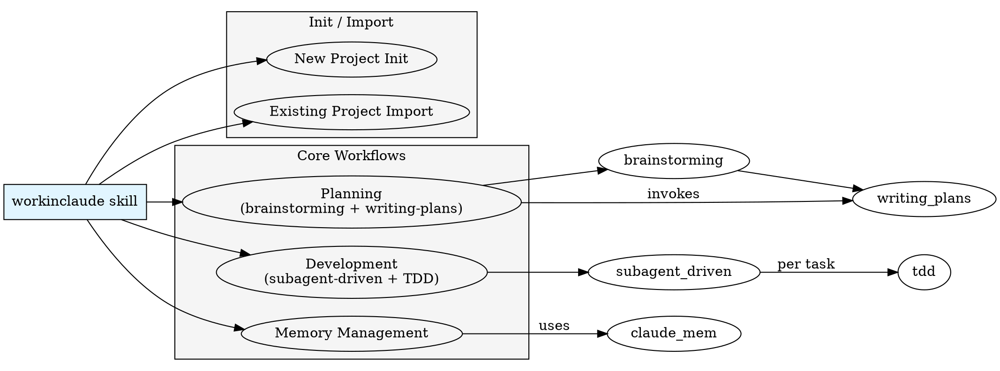

# WorkinClaude Skill Design

## Overview

A skill that orchestrates team collaboration workflows: planning, development, testing, and memory management. Uses brainstorming + TDD methodology and maintains project memory across sessions. Named "WorkinClaude" to reflect its focus on team-based development workflows within Claude.

**Core principle:** Standardized team workflows with flexible execution.

---

## Architecture



---

## Directory Structure

```
workinclaude/
  SKILL.md                    # Main orchestration skill
  workflows/
    init.md                    # Project initialization workflow
    planning.md                # Planning workflow
    development.md             # Development workflow  
    memory.md                  # Memory management
  templates/
    CLAUDE.local.template.md   # Local config template (git-ignored)
    memory/
      user_template.md         # User memory template
      feedback_template.md     # Feedback memory template
      project_template.md      # Project memory template
      reference_template.md    # Reference memory template
  default-skills/              # Built-in default skills (auto-install on init)
    karpathy-guidelines.md
    systematic-debugging.md
    writing-skills.md
  scripts/
    init-project.js           # Project initialization script
```

---

## Workflows

### 1. Init Workflow

**New Project Init:**
1. Scan project structure (language, framework, existing conventions)
2. Check default skills availability (karpathy-guidelines, systematic-debugging, writing-skills)
   - If missing → auto-install from `workinclaude/default-skills/` to project skills directory
3. Generate `CLAUDE.md` with project-level conventions
4. Generate `CLAUDE.local.template.md` for team members
5. Create `.claude/memory/` directory structure
6. Ensure `CLAUDE.local.md` in `.gitignore`
7. Initialize memory with project context

**Existing Project Import:**
1. Analyze existing project patterns and conventions
2. Generate `CLAUDE.md` capturing discovered patterns
3. Generate `CLAUDE.local.template.md`
4. Setup `.claude/memory/` if not exists
5. Create initial project memory (architecture, key decisions)

### 2. Planning Workflow

**Invokes:** `superpowers:brainstorming` → `superpowers:writing-plans`

1. Explore project context
2. Use brainstorming skill for requirements
3. Generate design spec → `docs/superpowers/specs/`
4. Generate implementation plan → `docs/superpowers/plans/`
5. Transition to development

### 3. Development Workflow

**Invokes:** `superagent-driven-development` for execution, `superpowers:test-driven-development` per task

1. Load implementation plan
2. For each task:
   - Create fresh worktree (if using worktrees)
   - Write failing test (RED)
   - Verify test fails correctly
   - Write minimal code (GREEN)
   - Verify test passes
   - Refactor if needed
   - Commit
3. Code review before completion

### 4. Memory Workflow

**Uses:** `.claude/memory/` as text-based team memory

**Memory Types:**
- `user.md` - Team member roles and preferences
- `feedback.md` - Team feedback on process and conventions
- `project.md` - Project context, decisions, goals
- `reference.md` - External resources and their purpose

**Operations:**

| Operation | Manual | Auto (Context-Aware) |
|-----------|--------|---------------------|
| Add | `/workinclaude memory add <type>` | Detect decisions during brainstorming/dev, prompt to save |
| Update | `/workinclaude memory update <type>` | Detect when context changes, suggest update |
| Search | `/workinclaude memory search <query>` | Always available |
| List | `/workinclaude memory list` | Always available |

**Auto-Detection Triggers:**
- Key architectural decisions made during brainstorming
- Conventions established (e.g., "we use snake_case for Python")
- External resources mentioned (APIs, libraries, docs)
- Team preferences or feedback expressed
- Goals or constraints identified

**Auto-Update Flow:**
```
1. Agent detects significant context during conversation
2. Agent prompts: "Should I save this to memory?"
3. User confirms or declines
4. If confirmed, Agent writes to appropriate memory file
5. If declined, Agent notes but doesn't write
```

**Manual Flow:**
```
1. User invokes: /workinclaude memory add <type>
2. User provides content or describes what to add
3. Agent writes to appropriate memory file
4. Agent confirms write successful
```

**Export/Share:**
- Memory files are plain markdown, easy to share via git
- Team lead can review memory during onboarding new members
- `grep` across memory files for quick lookup

---

## CLAUDE.md Structure (Generated)

```markdown
# Project Conventions

## Tech Stack
[Language, framework, key libraries]

## Coding Standards
[Naming conventions, code patterns]

## Workflow
[How the team works with this codebase]

## Testing
[Testing framework, coverage requirements]

## Documentation
[Where docs live, how to update]

---

## Team Memory
Memory directory: `.claude/memory/`
```

---

## CLAUDE.local.template.md Structure

```markdown
# Local Configuration

## Personal Info
- Name:
- Role:

## Preferences
[Coding preferences, workflow preferences]

## Notes
[Personal notes, reminders]
```

**Note:** This file is in `.gitignore` and should NOT be committed.

---

## Key Design Decisions

1. **Composite Skill:** Delegates to existing skills (brainstorming, writing-plans, tdd, subagent-driven-development) rather than reimplementing them

2. **Text-based Memory:** Uses `.claude/memory/` markdown files for team visibility, not MCP memory (which is agent-centric)

3. **Template-based Config:** `CLAUDE.local.template.md` is committed, individual `CLAUDE.local.md` is git-ignored

4. **Flexible Workflow:** Each phase can be invoked independently or as complete flow

5. **TDD per Task:** Test-driven development applied within each task during execution, not as global constraint

6. **Skill Naming:** Uses `workinclaude:` prefix for internal workflows, standard `superpowers:` for shared skills

7. **Default Skills:** `karpathy-guidelines`, `superpowers:systematic-debugging`, `superpowers:writing-skills` are always active for code work

---

## File Responsibilities

| File | Purpose |
|------|---------|
| `SKILL.md` | Main orchestration, entry points for each workflow |
| `workflows/init.md` | Project initialization logic |
| `workflows/planning.md` | Planning workflow (brainstorming integration) |
| `workflows/development.md` | Development workflow (subagent + TDD) |
| `workflows/memory.md` | Memory management operations |
| `templates/CLAUDE.local.template.md` | Template for team member local config |
| `default-skills/*.md` | Built-in default skills bundled with workinclaude |
| `scripts/init-project.js` | Script to automate project setup |

---

## Tech Stack Conventions

### Frontend

| Category | Recommended | Notes |
|----------|-------------|-------|
| UI Components | **shadcn/ui** | Headless, accessible, customizable |
| Styling | Tailwind CSS | Via `superpowers:tailwindcss` skill |
| State Management | Zustand / Jotai | Lightweight, minimal boilerplate |
| Forms | React Hook Form + Zod | Schema validation |

### Authentication

| Category | Recommended | Notes |
|----------|-------------|-------|
| Auth UI | **better-auth** | Modern, headless auth components |
| Auth Backend | Auth.js / NextAuth | For Next.js projects |
| OAuth | Support Google, GitHub OIDC | Check project requirements |

### Backend

| Category | Recommended | Notes |
|----------|-------------|-------|
| API Framework | Express / Fastify / Hono | Based on project stack |
| ORM | Prisma | Type-safe, great DX |
| Validation | Zod | Shared schema between frontend/backend |

### Database

| Category | Recommended | Notes |
|----------|-------------|-------|
| Primary DB | PostgreSQL | Use Supabase or standalone |
| Cache | Redis | For sessions, rate limiting |
| Search | Elasticsearch / Meilisearch | If full-text search needed |

### Infrastructure

| Category | Recommended | Notes |
|----------|-------------|-------|
| Deployment | Vercel / Fly.io / Render | Platform-dependent |
| CI/CD | GitHub Actions | Standard |
| Monitoring | Sentry + Datadog | Error tracking + APM |

---

## Brainstorming Tech Stack Defaults

When brainstorming new features, apply these defaults unless project specifies otherwise:

### UI/Frontend Features
```
1. Use document-skills:frontend-design skill for UI specifications
2. Use document-skills:ui-ux-pro-max skill for design system decisions
3. Prefer document-skills:shadcn components over custom implementations
4. Follow superpowers:tailwindcss skill for styling conventions
```

### Authentication Features
```
1. Use better-auth for auth UI components
2. Use Auth.js/NextAuth for backend session management
3. Always consider OAuth provider integration
4. Never roll custom auth - use established libraries
```

### Data Fetching
```
1. Server Components (React) / Server Actions
2. TanStack Query for client-side caching
3. REST for simple CRUD, GraphQL if complex relations
```

### Testing
```
1. Unit: Vitest / Jest
2. Integration: Playwright (E2E)
3. TDD: Always write tests first per tdd skill
```

---

## Skill Routing by Feature Type

| Feature Type | Primary Skills | Supporting Skills |
|--------------|----------------|-------------------|
| UI/Frontend | `workinclaude:frontend-design`, `document-skills:ui-ux-pro-max`, `document-skills:shadcn` | `superpowers:tailwindcss` |
| Auth/Users | `better-auth` (library) | — |
| API/Backend | (framework-specific) | `prisma` (if DB) |
| Database | `prisma` | — |
| DevOps/Infra | (project-specific) | — |
| Full-stack | Combine relevant skills | — |

---

## Default Skills (Always Active)

These skills are loaded by default for all code writing, reviewing, and refactoring:

| Skill | Purpose | When to Use |
|-------|---------|-------------|
| `karpathy-guidelines` | Behavioral guidelines to avoid common LLM coding mistakes | Always - code writing, reviewing, refactoring |
| `superpowers:systematic-debugging` | Debug methodology | When encountering bugs |
| `superpowers:writing-skills` | Skill creation | When creating/modifying skills |

**Karpathy Guidelines Summary:**
- Think before coding - state assumptions, surface tradeoffs
- Simplicity first - minimum code, no speculative features
- Surgical changes - touch only what you must
- Goal-driven execution - define verifiable success criteria

---

## Entry Points

### `/workinclaude init`
Initialize new or existing project for team collaboration.

### `/workinclaude plan`
Start planning workflow (brainstorming + writing-plans).

### `/workinclaude develop`
Execute development workflow using subagent-driven development with TDD.

### `/workinclaude memory`
Manage team memory (add, update, search, list).

### `/workinclaude memory add <type>`
Add new memory entry of specified type.
